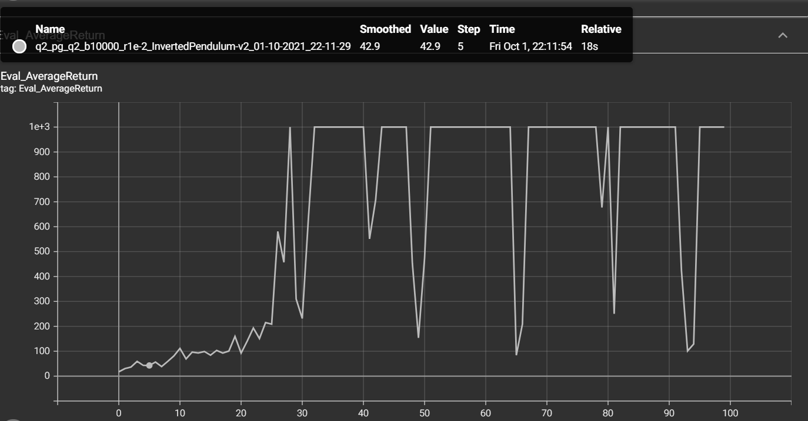
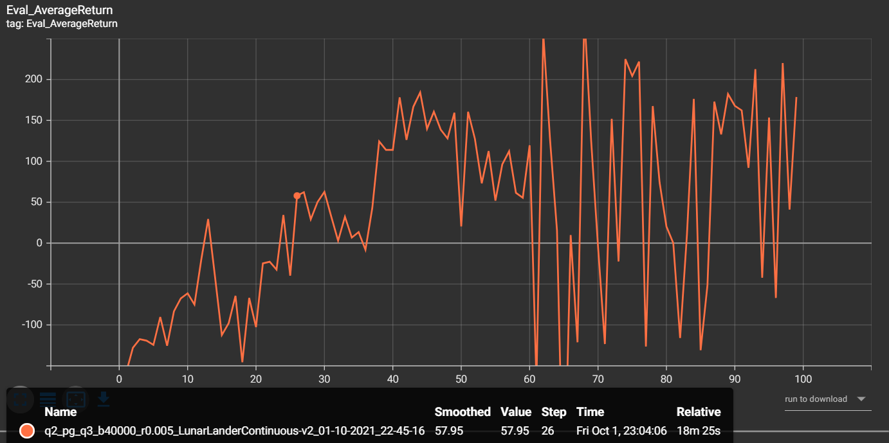

# Solutions to Homework 2

### Experiment 1
Ran these commands

```
python cs285/scripts/run_hw2.py --env_name CartPole-v0 -n 100 -b 1000 \-dsa --exp_name q1_sb_no_rtg_dsa

python cs285/scripts/run_hw2.py --env_name CartPole-v0 -n 100 -b 1000 \-rtg -dsa --exp_name q1_sb_rtg_dsa

python cs285/scripts/run_hw2.py --env_name CartPole-v0 -n 100 -b 1000 \-rtg --exp_name q1_sb_rtg_na

python cs285/scripts/run_hw2.py --env_name CartPole-v0 -n 100 -b 5000 \-dsa --exp_name q1_lb_no_rtg_dsa

python cs285/scripts/run_hw2.py --env_name CartPole-v0 -n 100 -b 5000 \-rtg -dsa --exp_name q1_lb_rtg_dsa

python cs285/scripts/run_hw2.py --env_name CartPole-v0 -n 100 -b 5000 \-rtg --exp_name q1_lb_rtg_na
```

**First graph, compare the learning curves (average return at each iteration) for the experiments prefixed with q1_sb_.  (The small batch experiments.)**


<br>
<br>

**Second graph, compare the learning curves (average return at each iteration) for the experiments prefixed with q1_lb_.  (The large batch experiments.)**


* From Graph 1 you can see that in the regime of dsa (disable standardization Advantage), the blue curve with rtg performs better than the orange one - trajectory-centric (without rtg )
* From Graph 2, you can see that when we run for larger batches, and use dsa (i.e. no standardization), Blue and pink ones i.e. without and with rtg are fairly close. Infact towards end, the pink (without rtg) shows some fluctuations which are not present in blue one.
* In small batch graph 1, not haing dsa (i.e. using advantage standardization) has helped. BUt for longer batch, the difference in not really noticable.
* Batch size has helped. Overall, we can see that Graph 2 with batch size of 5000 has performed better than the one with batch size of 1000.

### Experiment 2
Ran this command

```
python cs285/scripts/run_hw2.py --env_name InvertedPendulum-v2 \--ep_len 1000 --discount 0.9 -n 100 -l 2 -s 64 -b 10000 -lr 1e-2 -rtg \--exp_name q2_b10000_r1e-2
```
I did not spend lot of time to optimize to perfect values. The graph is given below



### Experiment 3
Ran this command

```
python cs285/scripts/run_hw2.py --env_name LunarLanderContinuous-v2 --ep_len 1000 --discount 0.99 -n 100 -l 2 -s 64 -b 40000 -lr 0.005 --reward_to_go --nn_baseline --exp_name q3_b40000_r0.005
```

The graph is given below:


### Experiment 4
Ran these set of commands

```
The range of the experiment was combination of 3 batch sizes with 3 learning rates. I could not not run the expeirment for b=50000 due to batch size.

b[10000,30000, 50000] 
learning rates[0.005,0.01,0.02]

b=10000, lr=0.005
python cs285/scripts/run_hw2.py --env_name HalfCheetah-v2 --ep_len 150 --discount 0.95 -n 100 -l 2 -s 32 -b 10000 -lr 0.005 -rtg --nn_baseline --exp_name q4_search_b10000_lr0.005_rtg_nnbaseline

b=10000, lr=0.01
python cs285/scripts/run_hw2.py --env_name HalfCheetah-v2 --ep_len 150 --discount 0.95 -n 100 -l 2 -s 32 -b 10000 -lr 0.01 -rtg --nn_baseline --exp_name q4_search_b10000_lr0.01_rtg_nnbaseline

b=10000, lr=0.02
python cs285/scripts/run_hw2.py --env_name HalfCheetah-v2 --ep_len 150 --discount 0.95 -n 100 -l 2 -s 32 -b 10000 -lr 0.02 -rtg --nn_baseline --exp_name q4_search_b10000_lr0.02_rtg_nnbaseline

b=30000, lr=0.005
python cs285/scripts/run_hw2.py --env_name HalfCheetah-v2 --ep_len 150 --discount 0.95 -n 100 -l 2 -s 32 -b 30000 -lr 0.005 -rtg --nn_baseline --exp_name q4_search_b30000_lr0.005_rtg_nnbaseline

b=30000, lr=0.01
python cs285/scripts/run_hw2.py --env_name HalfCheetah-v2 --ep_len 150 --discount 0.95 -n 100 -l 2 -s 32 -b 30000 -lr 0.01 -rtg --nn_baseline --exp_name q4_search_b30000_lr0.01_rtg_nnbaseline

b=30000, lr=0.02
python cs285/scripts/run_hw2.py --env_name HalfCheetah-v2 --ep_len 150 --discount 0.95 -n 100 -l 2 -s 32 -b 30000 -lr 0.02 -rtg --nn_baseline --exp_name q4_search_b30000_lr0.02_rtg_nnbaseline

```

The plot for these 6 runs is given below:


The best run is b=30000, lr=0.02. We will use this for next part of Experiment 4.

### Experiment 4B
Now with best params b=30000, lr=0.02, we run various other options - with and without baselines, and with and without rtg.

The commands run were:

```
python cs285/scripts/run_hw2.py --env_name HalfCheetah-v2 --ep_len 150 --discount 0.95 -n 100 -l 2 -s 32 -b 30000 -lr 0.02 --exp_name q4_b30000_r0.02

python cs285/scripts/run_hw2.py --env_name HalfCheetah-v2 --ep_len 150 --discount 0.95 -n 100 -l 2 -s 32 -b 30000 -lr 0.02 -rtg --exp_name q4_b30000_r0.02_rtg

python cs285/scripts/run_hw2.py --env_name HalfCheetah-v2 --ep_len 150 --discount 0.95 -n 100 -l 2 -s 32 -b 30000 -lr 0.02 --nn_baseline --exp_name q4_b30000_r0.02_nnbaseline


python cs285/scripts/run_hw2.py --env_name HalfCheetah-v2 --ep_len 150 --discount 0.95 -n 100 -l 2 -s 32 -b 30000 -lr 0.02 -rtg --nn_baseline --exp_name q4_b30000_r0.02_rtg_nnbaseline

```
 
The graph for above run is given below:


## Experiment 5
 Ran the following commands

```
python cs285/scripts/run_hw2.py --env_name Hopper-v2 --ep_len 1000 --discount 0.99 -n 300 -l 2 -s 32 -b 2000 -lr 0.001 --reward_to_go --nn_baseline --action_noise_std 0.5 --gae_lambda 0.0 --exp_name q5_b2000_r0.001_lambda0.0

python cs285/scripts/run_hw2.py --env_name Hopper-v2 --ep_len 1000 --discount 0.99 -n 300 -l 2 -s 32 -b 2000 -lr 0.001 --reward_to_go --nn_baseline --action_noise_std 0.5 --gae_lambda 0.95 --exp_name q5_b2000_r0.001_lambda0.95

python cs285/scripts/run_hw2.py --env_name Hopper-v2 --ep_len 1000 --discount 0.99 -n 300 -l 2 -s 32 -b 2000 -lr 0.001 --reward_to_go --nn_baseline --action_noise_std 0.5 --gae_lambda 0.99 --exp_name q5_b2000_r0.001_lambda0.99

python cs285/scripts/run_hw2.py --env_name Hopper-v2 --ep_len 1000 --discount 0.99 -n 300 -l 2 -s 32 -b 2000 -lr 0.001 --reward_to_go --nn_baseline --action_noise_std 0.5 --gae_lambda 1.0 --exp_name q5_b2000_r0.001_lambda1.0

```

The graph is given below:


